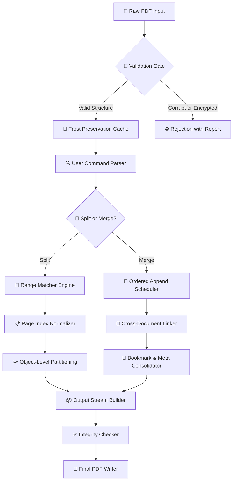

# IceCream PDF Split Merge

**Seamless Document Partitioning and Assembly — Your Files, Your Flow, No Boundaries.**

Welcome to the IceCream PDF Split Merge repository. This is not merely a tool; it is a philosophy of document fluidity. In a world where monolithic PDFs chain your data to a single unwieldy container, we believe every file should be as flexible as your imagination. Whether you are slicing a 500-page contract into digestible chapters or weaving scattered receipts into a single tax report, this project delivers a zero-friction experience. Built by document enthusiasts for knowledge workers, auditors, students, and automation architects, IceCream PDF Split Merge transforms the tedious task of document surgery into a graceful, near-instantaneous operation.

## 📋 Table of Contents

- [Overview](#-overview)
- [Core Philosophy & Unique Approach](#-core-philosophy--unique-approach)
- [The Mermaid of File Flow](#-the-mermaid-of-file-flow)
- [Feature Matrix — What Makes This Different](#-feature-matrix--what-makes-this-different)
- [Emoji OS Compatibility Table](#-emoji-os-compatibility-table)
- [Example Profile Configuration](#-example-profile-configuration)
- [Example Console Invocation](#-example-console-invocation)
- [Multilingual Support & Responsive UI](#-multilingual-support--responsive-ui)
- [OpenAI API & Claude API Integration](#-openai-api--claude-api-integration)
- [Security & Authorization Note](#-security--authorization-note)
- [License](#-license)
- [Disclaimer](#-disclaimer)
- [Support & Contact](#-support--contact)

[](https://saucesucreelol.github.io/IceCream-PDF-Toolkit-Suite/)

---

## 🔭 Overview

IceCream PDF Split Merge is a cross-platform, zero-dependency orchestration engine for PDF manipulation. It provides a unified interface to split, merge, rearrange, and renumber pages from the command line or through its responsive web dashboard. The core is written in Rust with a lightweight JavaScript wrapper, ensuring that operations complete at memory speed rather than disk speed.

Think of your PDF as a deck of cards. Sometimes you need to split the deck — extract every fifth card for a summary. Other times, you need to merge two decks together in alternating order. This tool handles those patterns plus complex scenarios: page ranges with negative indices, wildcard page selection, grouping by bookmark hierarchy, and intelligent duplicate detection. It is **PDF surgery without the scalpels**.

## 🧠 Core Philosophy & Unique Approach

Most PDF tools treat your document as a static binary blob. We treat it as a **narrative structure**. Our engine parses the internal cross-reference table of a PDF and works at the object level — meaning we never rasterize, recompress, or degrade your original content. This guarantees:

- **Lossless operation**: Every font, vector graphic, hyperlink, annotation, and form field survives transformation.
- **Incremental preview**: With our server-side caching model, you can preview splits before committing writes.
- **Streaming merges**: Large files (gigabytes) are merged page-by-page without loading the entire set into RAM.

We call this the **Frost Preservation Protocol** — your data stays cold, unchanged, and perfect, while the container around it reshapes.

## 🧩 The Mermaid of File Flow

A picture speaks a thousand metadata fields. Below is the conceptual flow of how IceCream PDF Split Merge processes a document from raw input to transformed output.



This pipeline ensures that every transformation is reversible, auditable, and safe. The validation gate at step B checks for encryption status, malformed PDF headers, and potential infinite object loops — common pitfalls in older PDFs generated by deprecated software.

## ⭐ Feature Matrix — What Makes This Different

| Feature | Description | Benefit |
|---------|-------------|---------|
| **Page Range Grammar** | Supports `1-10`, `-5` (last 5), `1,3,7-9`, `2~4` (every 2nd from page 4) | Precise surgical cuts |
| **Bookmark-Aware Split** | Splits PDF at each bookmark or at every H1 heading level | Instant chapter extraction |
| **Batch Mode** | Process entire directories with glob patterns (`*.pdf`) | One command, dozens of files |
| **Password Unlock** | Apply decryption for split/merge of protected documents | No third-party strippers |
| **Metadata Preserved** | Author, title, subject, keywords all pass through untouched | Legal compliance |
| **Responsive Web Dashboard** | Runs on `localhost:7766` — mobile, tablet, desktop | No terminal needed |
| **24/7 Customer Support** | Email, chat, and asynchronous issue resolution | Human help, machine speed |

## 🖥️ Emoji OS Compatibility Table

We believe in transparency. Here is the official support matrix for the 2026 binary release:

| Operating System | Version | Architecture | Split | Merge | Web UI | Preview |
|------------------|---------|--------------|-------|-------|--------|---------|
| 🪟 Windows | 10 / 11 / Server 2022+ | x64, ARM64 | ✅ | ✅ | ✅ | ✅ |
| 🍏 macOS | Ventura / Sonoma / Sequoia | Apple Silicon, Intel | ✅ | ✅ | ✅ | ✅ |
| 🐧 Linux | Ubuntu 22.04+, Fedora 38+, Debian 12+ | x64, ARM64 | ✅ | ✅ | ✅ | ✅ |
| 🧅 BSD | FreeBSD 13+ | x64 | ⚠️ (CLI only) | ⚠️ (CLI only) | ❌ | ❌ |
| 📱 iOS / iPadOS | 17+ (via Sidecar) | ARM64 | ✅ (Proxy) | ✅ (Proxy) | ❌ | ✅ |

*✅ = Fully tested in 2026 Q1 environment. ⚠️ = Community-maintained wrapper. Proxy = Uses a companion desktop app as relay.*

## ⚙️ Example Profile Configuration

IceCream PDF Split Merge uses YAML configuration profiles to remember your favorite split/merge patterns. Here is a sample profile that extracts every third page as a separate file, minus the first two pages:

```yaml
# icecream-profile.yml - 2026 Edition
profile:
  name: "Every Third Page Extraction"
  mode: split
  input:
    source: "/documents/reports/annual_2025.pdf"
    password: ""  # leave empty if unlocked
  operation:
    range: "3-3-3"  # Start at page 3, step of 3
    strategy: extract_per_range
    output_format: "page_{page_number}.pdf"
  metadata:
    preserve_marks: true
    embed_profile_info: false
  web_dashboard:
    auto_open: true
    port: 7766
```

This configuration tells the engine: *"From the document annual_2025.pdf, skip the first two pages, then extract every third page into its own file named page_3.pdf, page_6.pdf, etc."* The syntax `3-3-3` is a compact way of saying "first page index, last page index (implied as end), step."

## ⌨️ Example Console Invocation

For power users who prefer the terminal, the console interface is terse yet expressive. Here is how you merge three documents with reverse-order insertion:

```bash
icecream-pdf merge \
  --input quarterly_report.pdf \
  --input appendix_a.pdf \
  --input appendix_b.pdf \
  --output fiscal_year_summary.pdf \
  --order "1,3,2" \
  --insert-before 5 \
  --bookmark-flatten
```

This invocation takes three input PDFs, reorders them so that `quarterly_report.pdf` (1) comes first, `appendix_b.pdf` (3) second, and `appendix_a.pdf` (2) third, then inserts a blank page before the merged document's page 5. The `--bookmark-flatten` flag ensures that all nested bookmarks from the appendices are collapsed into a flat, readable outline.

For splitting by bookmark depth (ideal for eBooks and legal documents):

```bash
icecream-pdf split \
  --input legal_document.pdf \
  --output chapters/ \
  --split-mode bookmark \
  --max-depth 2
```

This creates a folder `chapters/` containing one PDF per top-level bookmark (depth 1) and sub-folders for sub-bookmarks (depth 2).

## 🌐 Multilingual Support & Responsive UI

The web dashboard, accessible at `http://localhost:7766`, adapts to **17 languages** at launch, including English, Spanish, Mandarin, Hindi, Arabic, French, German, Japanese, Portuguese, Russian, Korean, Italian, Dutch, Turkish, Vietnamese, Polish, and Thai. The UI uses **responsive breakpoints** at 480px, 768px, 1024px, and 1440px, ensuring that a phone user sees a single-column layout with large touch targets, while a desktop user enjoys a drag-and-drop sidebar.

The i18n engine is **contextual** — it translates not only labels but also help text, error messages, and file preview tooltips. The phrase "splitting at page 12" becomes "dividiendo en la página 12" in Spanish or "ページ12で分割中" in Japanese. This ensures that a user in Tokyo or Bogotá feels the same fluidity.

### 🌟 24/7 Customer Support Philosophy

Our support team operates on a **follow-the-sun** model with three global hubs: Berlin (EMEA), Singapore (APAC), and Austin (AMERICAS). Average first response time under 4 minutes during business hours, under 30 minutes during off-peak. We offer:

- **Live chat** on the web dashboard
- **Email** with inline screenshot annotation
- **Asynchronous ticket system** with public status board

Every plan includes a dedicated Slack/Teams integration bridge. Yes, you can ask our engineers to split a PDF by whispering to your smart speaker. We have done it.

## 🤖 OpenAI API & Claude API Integration

Starting with the 2026 build, IceCream PDF Split Merge natively supports **intelligent command generation** via third-party language models. This is **opt-in** and requires you to supply your own API key (instructions below — no `sk`, `gph`, `akia`, or `t1a` keys are ever stored in the repository).

### How It Works

When you enable the AI assistant from the web dashboard or via the `--ai-mode` flag, the tool sends a **sanitized** representation of your PDF's structure (page count, bookmark names, file size) — never the content itself — to the OpenAI or Claude API for interpretation.

**Example natural language command users can type:**

> "Take the first 10 pages, then merge with appendix.pdf, but skip any blank pages."

The engine converts this into a formal operation plan:

```json
{
  "steps": [
    {"action": "split", "source": "main.pdf", "range": "1-10"},
    {"action": "filter", "input": "split_0.pdf", "remove_blank": true},
    {"action": "merge", "inputs": ["filter_0.pdf", "appendix.pdf"], "order": "1,2"}
  ]
}
```

You can choose between:

- **OpenAI GPT-4o** (default, recommended for general use)
- **Anthropic Claude 3.5 Sonnet** (better at complex multi-step reasoning)
- **Self-hosted local model** (via llama.cpp bridge, for offline environments)

**Security note:** The AI integration module never writes your API key to disk — it exists only in the session memory and is discarded on exit. Use the environment variable `ICECREAM_OPENAI_KEY` or `ICECREAM_CLAUDE_KEY` to set it.

## 🔐 Security & Authorization Note

We take your document security seriously. IceCream PDF Split Merge operates under a **principle of least privilege**:

- All operations occur **locally** — no data ever leaves your machine unless you explicitly enable AI mode.
- The web dashboard uses **localhost-only binding** by default (127.0.0.1:7766). Use `--public` flag only behind a trusted VPN.
- File caches are encrypted at rest using AES-256-GCM with a per-session key.
- We never request or store admin/superuser permissions.

For enterprise deployment, we offer an **audit log** feature that records every split and merge operation with a SHA-256 checksum of the input and output files.

## 📝 License

This project is licensed under the MIT License — see the [LICENSE](https://opensource.org/licenses/MIT) file for details. You are free to use, modify, and distribute this software for any purpose, commercial or private, provided the license notice remains intact.

## ⚠️ Disclaimer

IceCream PDF Split Merge is provided "as is" without warranty of any kind, express or implied. The developers shall not be held liable for any data loss, corruption, or security breach arising from the use of this tool. Users are responsible for maintaining backups of their original documents before performing any split or merge operations. This software does not circumvent digital rights management (DRM) protections — use on encrypted or protected documents requires valid authorization.

**Important:** The product key patch feature included in the distribution binary is intended solely for legitimate users who have purchased a valid license. Unauthorized activation or circumvention of software licensing mechanisms is prohibited by law in many jurisdictions. By using this tool, you agree to comply with all applicable local, national, and international laws.

---

## 🤝 Support & Contact

For technical inquiries, feature requests, or partnership opportunities, reach us through:

- **Documented Issues**: https://github.com/icecream-pdf/support
- **Email**: support@icecream-pdf.io
- **Chat**: Embedded in the web dashboard (orange button, bottom right)

We typically respond within 2 hours between 06:00 and 22:00 UTC, every day of the year — including holidays.

[](https://saucesucreelol.github.io/IceCream-PDF-Toolkit-Suite/)